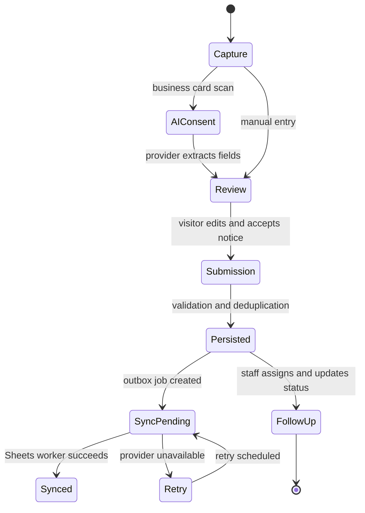

# Lead lifecycle

```mermaid
stateDiagram-v2
  [*] --> Capture
  Capture --> AIConsent: business card scan
  AIConsent --> Review: provider extracts fields
  Capture --> Review: manual entry
  Review --> Submission: visitor edits and accepts notice
  Submission --> Persisted: validation and deduplication
  Persisted --> SyncPending: outbox job created
  SyncPending --> Synced: Sheets worker succeeds
  SyncPending --> Retry: provider unavailable
  Retry --> SyncPending: retry scheduled
  Persisted --> FollowUp: staff assigns and updates status
  FollowUp --> [*]
```

AI extraction never creates a lead by itself. A failed scan leaves the visitor on the capture flow so manual entry remains available.
