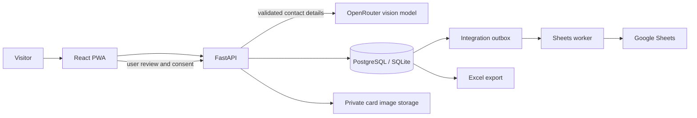

# System architecture

```mermaid
flowchart LR
  Visitor --> Web[React PWA]
  Web --> API[FastAPI]
  API -->|validated contact details| OpenRouter[OpenRouter vision model]
  API --> DB[(PostgreSQL / SQLite)]
  API --> PrivateImages[Private card image storage]
  DB --> Outbox[Integration outbox]
  Outbox --> Worker[Sheets worker]
  Worker --> Sheets[Google Sheets]
  DB --> Export[Excel export]
  Web -->|user review and consent| API
```

The API owns provider credentials, validation, persistence, and private image access. AI results are returned for visitor review and never submitted automatically.
